# Git Flow

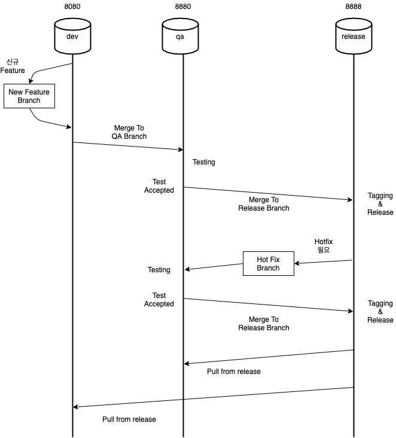

# 빌드 하는법

## Local

### Intellij
- Profile이 3개로 나뉘어있고(dev, qa, release) 아무런 설정을 하지 않고 실행시, dev가 적용된다 
- dev는 그냥 Boot run 해주면 된다

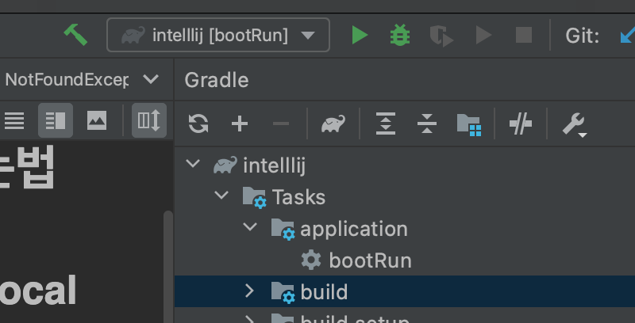

- qa와 release는 새 configuration을 만들어줘야 한다

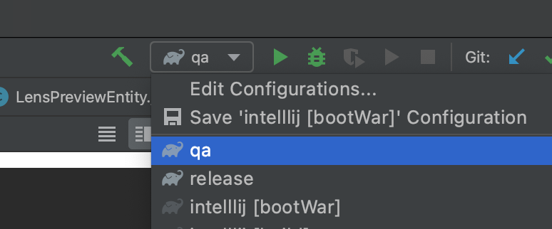

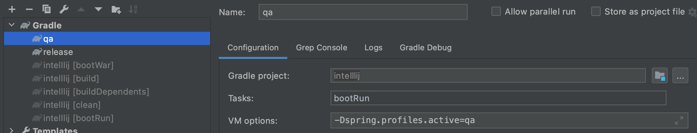

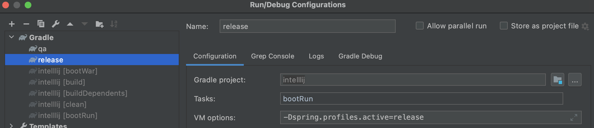

- 위와 같이 구성 하고, 원하는 프로파일로 실행 한다

- http://localhost:8080/swagger-ui.html 로 접속하면 swagger 실행이 확인 가능하다
  
### Docker
- 이 프로젝트는 dockerize 되어 있어 docker 환경에서 실행 가능하다
- 다음과 같은 순서대로 실행한다

1. gradle build
```
./gradlew build
```

2. Containerize
```
docker build --build-arg JAR_FILE="build/libs/*.war" -t springio/gs-spring-boot-docker .
```

3. Run on docker
```
docker run -d -p 8080:8080 --name lens springio/gs-spring-boot-docker
```

- http://localhost:8080/swagger-ui.html 로 접속하면 swagger 실행이 확인 가능하다


## Ansible
- 먼저 Ansible에 접속한다
  + http://wy0105.iptime.org:8081/#/login
    
- 좌측의 template 메뉴를 누르면 아래와 같은 template 들을 확인 할 수 있다
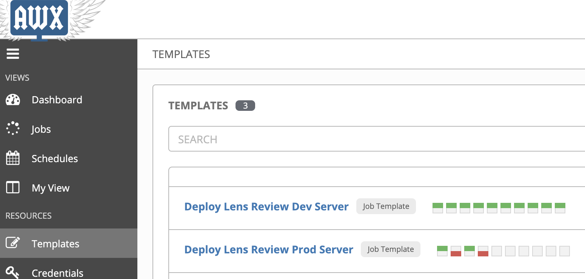
    
- Dev 서버를 배포하고 싶은 경우 Deploy Lens Review Dev Server를 선택한다. 여기서는 특별히 바꿀것 없이 launch 버튼을 누르면 된다
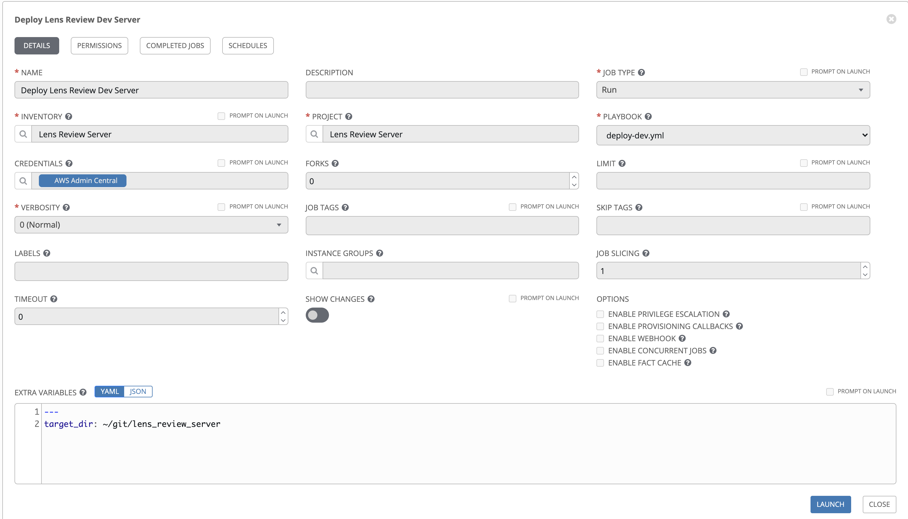
  
- Prod 서버를 배포하고 싶은 경우 Deploy Lens Review Dev Server를 선택한다. 여기서는 원하는 버전명을 target_ver를 적어줘야 한다
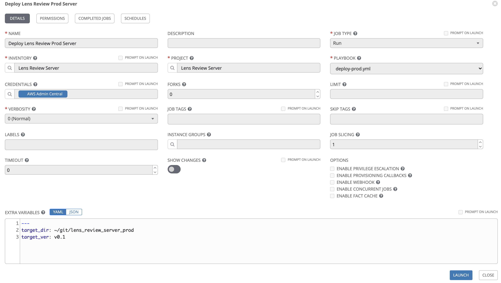
  + 버전명은 깃헙의 tag를 사용하는데, https://github.com/wanna-go-home/lens_review_server/tags 에서 확인 가능하다
    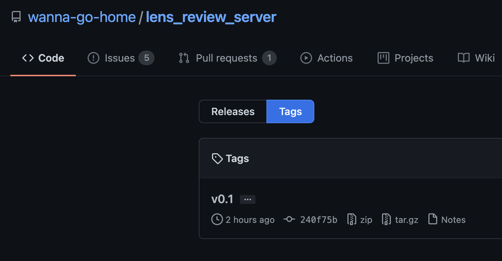
    
  + 새 tag를 발행하고 싶은 경우 Release 항목에서 Draft new release를 눌러서 새 Release를 만들어서 그 Release의 tag를 쓰도록 한다
  + tag의 target branch는 release를 사용 하도록 한다
    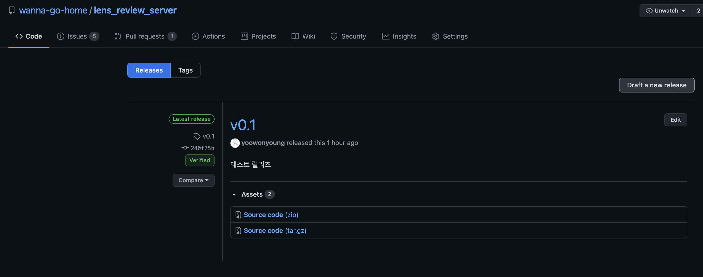
    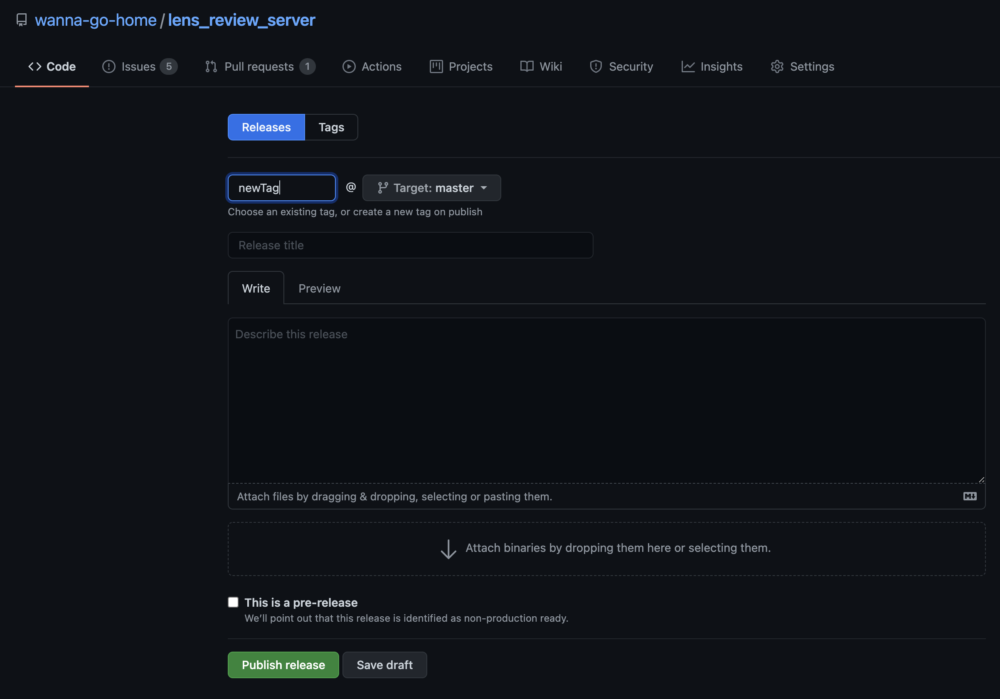


